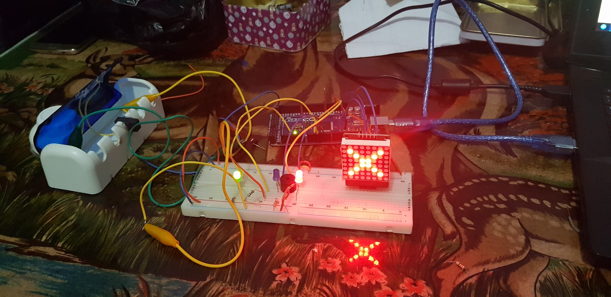
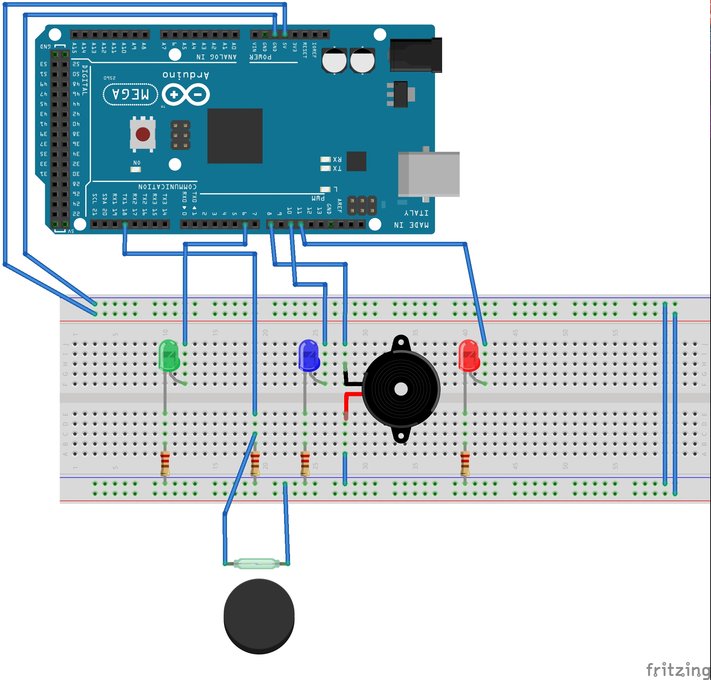
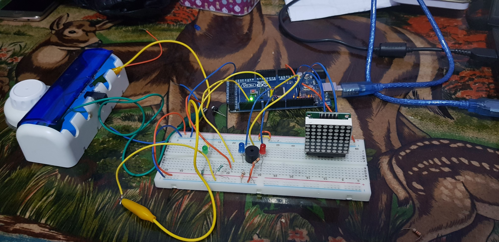

# Alarma de Seguridad en Arduino

Simulación de alarma de seguridad en puerta residencial contra ladrones.


## Autor
**Nombre:** Alfredo Valdivia barajas

**Universidad:** Instituto Tecnológico de León

**Carrera:** Ingeniería en Sistemas Computacionales


## Empezando
El proyecto que se muestra es para pruebas y se puede correr en cualquier sistema operarivo pero se recomienda Linux

### Prerrequisitos
```
-Linux o Windows de 64-bit
-Arduino IDE
-Arduino 1 o superior
-Protoboard
-Cable de Protoboard
-3 Leds (rojo, azul y amarillo)
-4 Resistencias (de 230ohmz a 1kohm)
-1 Reed switch
-1 Imán
-1 Speaker
```

### Instalación 

Los pasos a seguir son los siguientes

```
Clonar repositorio o bien, descargar el archivo Alarma_Puerta.ino y guardarlo 
en una carpeta que tenga el mismo nombre, 
si se clona el repositorio la carpeta será correcta.
```
```
Abrir el archivo Alarma_Puerta.ino con Arduino IDE
```
```
Realizar la conexión de los componentes como se muestra en la imagen 
(se muestra el ejemplo con Arduino Mega 256, se debe acoplar para otros modelos)
```

```
Compilar código para verificar que no haya errores
```
```
Subir código a Arduino y ver funcionamiento
```



## Creado con

* [Dropwizard](https://dillinger.io/) 

## Contribuciones

Actualmente no hay opciones de contribución, cualquier sugerencia vea la sección de contacto

## Control de versiones

Para control de versiones revise este mismo repositoriorepositoryen (https://github.com/alfredo97/alarma_puerta/). 

## Autores

* **Alfredo Valdivia Barajas** 


## Licencia

No hay una licencia para este proyecto actualmente, es posible usarlo de manera libre

## Agradecimientos

* Gracias a todos los que usen este software de manera libre

